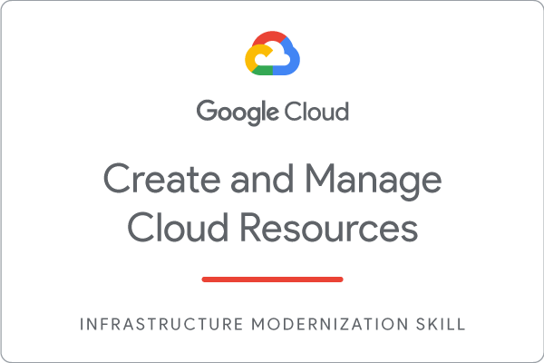

<p align="center">
    
</p>

# Create and Manage Cloud Resources: Challenge Lab


# Task 1 - Create a project jumphost instance

<b>Use Cloud GUI for Instance Creation</b>

Compute Engine ➟ VM Instances

Create Instance using Given [<b>Instance Name</b>]

Machine Type <b>N1 - f1 micro</b>
# Task 2 - Create a Kubernetes service cluster

Zone : us-east1-b

Docker container [hello-app] : gcr.io/google-samples/hello-app:2.0 (check for version change if any)

Replace <b>[PORT] </b> with <b>Given Port Number for your Project</b>.
```md
gcloud config set compute/zone us-east1-b
```
  
  
```md
gcloud container clusters create [ANY NAME]
```
```md
gcloud container clusters get-credentials [SAME NAME AS ABOVE ONE]
```
```md
kubectl create deployment hello-server --image=gcr.io/google-samples/hello-app:2.0
```
```md
kubectl expose deployment hello-server --type=LoadBalancer --port [PORT]
```

# Task 3 - Set up an HTTP load balancer

```md
gcloud compute instance-templates create web-server-template \
          --metadata-from-file startup-script=startup.sh \
          --network nucleus-vpc \
          --machine-type g1-small \
          --region us-east1
```
```md
gcloud compute instance-groups managed create web-server-group \
          --base-instance-name web-server \
          --size 2 \
          --template web-server-template \
          --region us-east1
```
Replace <b>[FIREWALL] </b> with <b>Given Firewall Name for your Project</b>.
```md
gcloud compute firewall-rules create [FIREWALL] \
          --allow tcp:80 \
          --network nucleus-vpc
gcloud compute http-health-checks create http-basic-check
gcloud compute instance-groups managed \
          set-named-ports web-server-group \
          --named-ports http:80 \
          --region us-east1
```
```md
gcloud compute backend-services create web-server-backend \
          --protocol HTTP \
          --http-health-checks http-basic-check \
          --global
gcloud compute backend-services add-backend web-server-backend \
          --instance-group web-server-group \
          --instance-group-region us-east1 \
          --global
```

```md
gcloud compute url-maps create web-server-map \
          --default-service web-server-backend
gcloud compute target-http-proxies create http-lb-proxy \
          --url-map web-server-map
```
```md
gcloud compute forwarding-rules create http-content-rule \
        --global \
        --target-http-proxy http-lb-proxy \
        --ports 80
```

```md
gcloud compute forwarding-rules list
```
